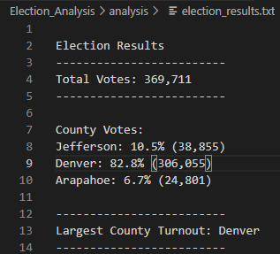
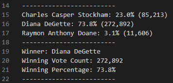

# Election_Analysis
Performing analysis on election results data.

## Overview of Election Audit
A Colorado Board of Elections employee will be assisted with the following tasks to complete the election audit of a recent local congressional election.

1. Calculate the total number of votes cast.
2. Get a complete list of candidates who received votes.
3. Calculate the total number of votes each candidate received.
4. Calculate the percentage of votes each candidate won.
5. Determine the winner of the election based on popular votes

Other additional tasks requested to complete the audit include:
1. The voter turnout for each county.
2. The percentage of votes from each county out of the total count.
3. The county with the highest turnout

## Resources
- Data Source: This analysis was performed using the [election_results.csv](https://github.com/aobasuyi/Election_Analysis/blob/main/Resources/election_results.csv) dataset.
- Software: Python 3.7.6, Visual Studio Code, 1.56

## Election-Audit Results
The election results show that:
- There were **369,711** votes cast in the election.

**County Results:**<br />
The number of votes and the percentage of total votes for each county in the precinct:
- The counties:
    - Jefferson
    - Denver
    - Arapahoe
- The percentage and the number of county votes:
    - Jefferson received **10.5%** of the vote and **38,855** number of votes.
    - Denver received **82.8%** of the vote and **306,055** number of votes.
    - Arapahoe received **6.7%** of the vote and **24,801** number of votes.
- The county with the highest voter turnout was:
    - **Denver** which received **82.8%** of the vote and **306,055** number of votes
 
 <br /> *

**Candidate Results:**<br />
The number of votes and the percentage of the total votes each candidate received:
- The candidates:
    - Charles Casper Stockham
    - Diana DeGette
    - Raymon Anthony Doane
- The candidates' results:
    - Candidate Charles Casper Stockham received **23.0%** of the vote and **85,213** number of votes.
    - Candidate Diana DeGette received **73.8%** of the vote and **272,892** number of votes.
    - Candidate Raymon Anthony Doane received **3.1%** of the vote and **11,606** number of votes.
- The winner of the election was:
    - **Diana DeGette** who received **73.8%** of the vote and **272,892** number of votes.

<br /> *

## Election-Audit Summary
A proposal to the election commission on how this script can be used for any election include
1. To update the name of the election results CSV file in the script to ensure the correct file is loaded each time.
2. To update the name of the election results text file to avoid overwriting previous election results 
Some examples for modifying the script include

```
# Change the name of the file to load from a path.
file_to_load = os.path.join("Resources", "new_file.csv")

# Change the name of election results text file
file_to_save = os.path.join("analysis", "new_results.txt")
```
